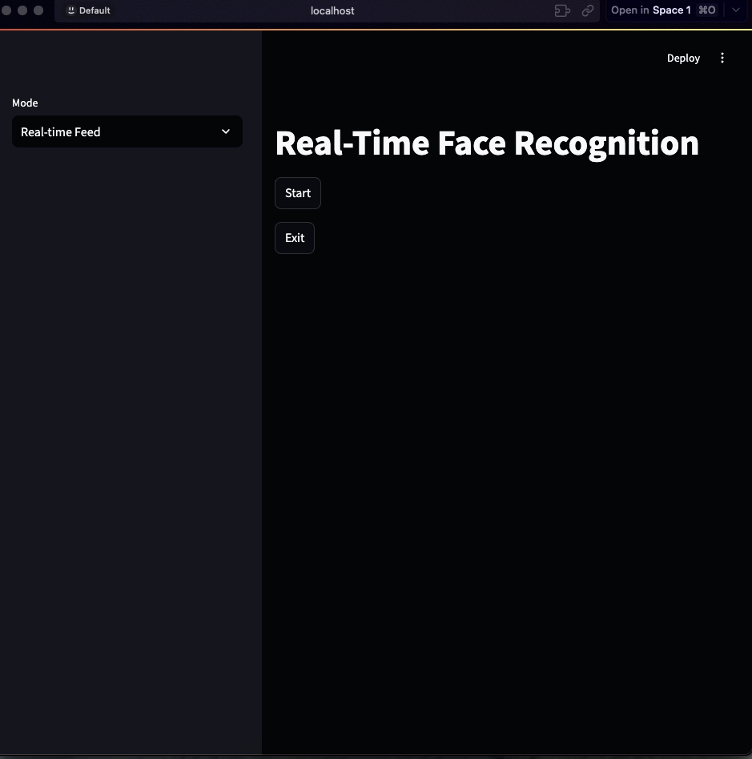
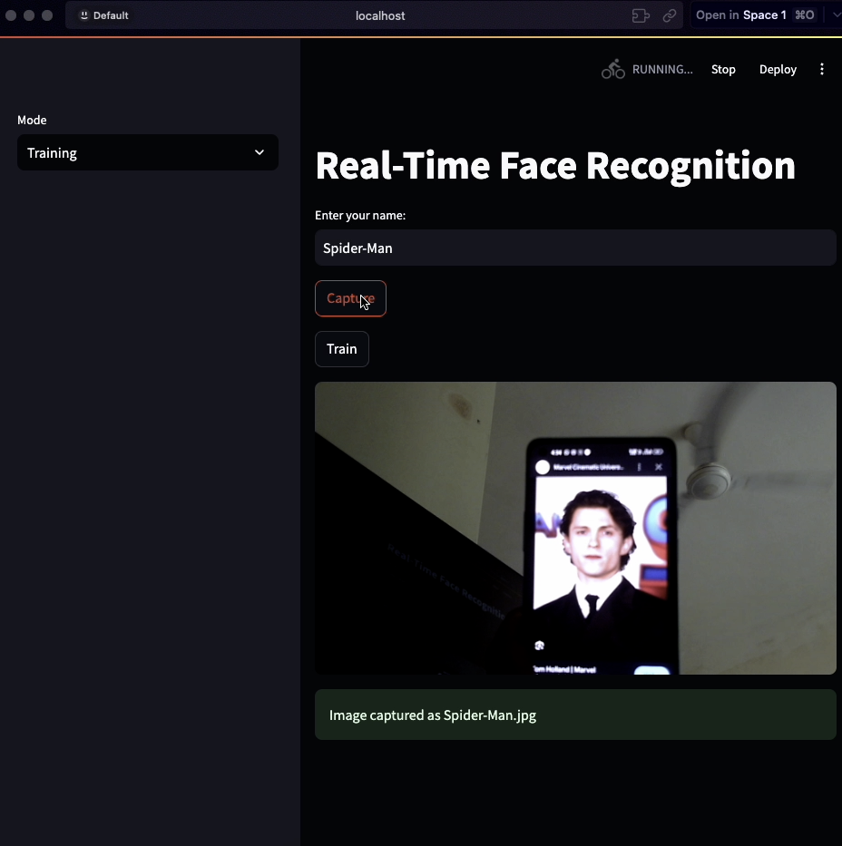

# **One-Shot Face Recognition**  
🚀 **Real-Time Face Recognition Using DeepFace**  

This is a **one-shot face recognition** system that can recognize faces **in real-time** using a **single image** as training data. It uses **DeepFace** for accurate face matching and can be used in various applications like:  

- **Attendance Systems** 📋  
- **Security & Surveillance** 🔍  
- **Smart Home Access** 🚪  
- **Personalized AI Assistants** 🤖  

## **🔧 Features**
✅ **One-shot learning** – Train with just one image per person  
✅ **Real-time face recognition** – Uses `DeepFace.stream()`  
✅ **Supports multiple people** – Can recognize different faces from a small database  
✅ **Web Interface with Streamlit** – Simple and easy to use  
✅ **Fast & Lightweight** – Runs smoothly without `dlib` dependencies  
---

## **📸 Demo Images**  
✨ Below are some snapshots showcasing the project in action!  

<div align="center">

### **🎯 Training Phase**  
🟢 Capturing and registering a new face into the system.  
  

### **🧪 Testing Phase**  
🔍 Recognizing faces in real-time!  
  

### **🚀 Real-Time Face Recognition**  
🖥️ Identifying faces dynamically with bounding boxes!  
  

</div>  

---

## **🚀 How to Use**
### **1️⃣ Install Dependencies**  
```bash
pip install -r requirements.txt
```
### 2️⃣ Run the App
```bash
streamlit run app.py
```


3️⃣ Train a New Face
	•	Go to the “Training” tab
	•	Enter a name
	•	Click “Capture” to save an image
	•	Face is now stored in the database 🎉

4️⃣ Recognize Faces in Real-Time
	•	Go to the “Real-time Feed” tab
	•	Click “Start” to begin recognition
	•	Your face should be detected and labeled ✅


🛠 Technologies Used
	•	Python 🐍
	•	OpenCV – For camera feed and image processing
	•	DeepFace – For face recognition
	•	Streamlit – For an interactive web UI


📌 Future Enhancements

🔹 Add multiple face recognition in one frame
🔹 Implement a cloud-based API for larger databases
🔹 Support face recognition on edge devices (Raspberry Pi, Jetson Nano)
